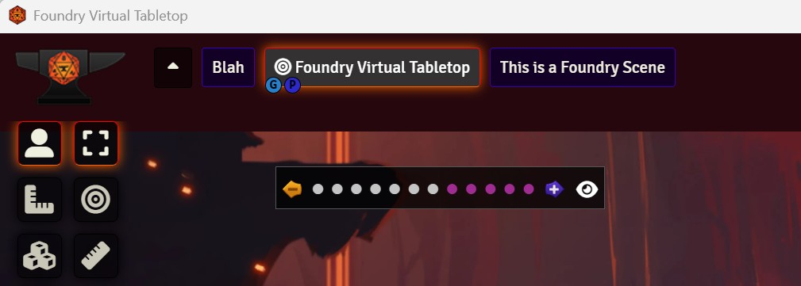
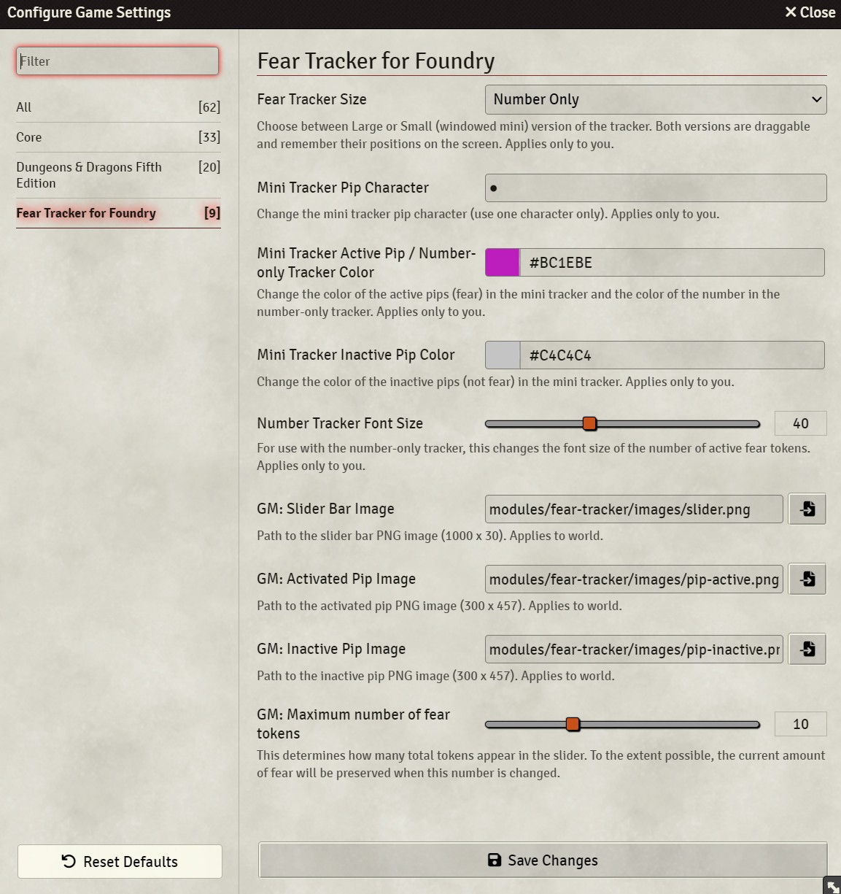

# Fear Tracker for Foundry
A simple overlay compatible with the Daggerheart game system that tracks GM fear tokens. Players and GM see a slider bar with tokens. GM can move tokens left (inactive) or right (active) when they gain and use fear. GM can make the bar invisible for everyone (GM will see half-opacity bar). The following things are customizable:
- use standard (large), mini (pip) tracker, or a number-only tracker (client scope)
- for the mini tracker:
  - character used for the pip (client scope)
  - colors used for active/inactive tokens (client scope)
- for the number-only tracker:
  - color used for the active fear number (client scope) 
- set max number of fear tokens (GM only)
- images used for standard version slider bar and tokens (GM only)

Standard (large) tracker:

Mini tracker:

Number-only tracker:

Settings Dialog:

Plan to have additional themes (images) at some point, but for now, custom images can be used for the slider bar and tokens via the module's settings.

Copyright notice:
This product includes materials from the Daggerheart System Reference Document 1.0 (https://www.daggerheart.com/wp-content/uploads/2025/05/DH-SRD-May202025.pdf), © Critical Role, LLC. All rights reserved. "Daggerheart" is a registered trademark of Darrington Press, LLC. Used under the Darrington Press Community Gaming License (https://darringtonpress.com/wp-content/uploads/2025/06/DPCGL-June-26-2025.pdf) with Foundry as a whitelisted VTT (https://darringtonpress.com/license/).

Issues:
- [here they are](https://github.com/andrewbrick/Daggerheart-Fear-Tracker-for-Foundry/issues)

It's my first module. I'm trying. Help appreciated. :)

Feature Roadmap:
- number-only version
- additional themes
- cooler animations? 
